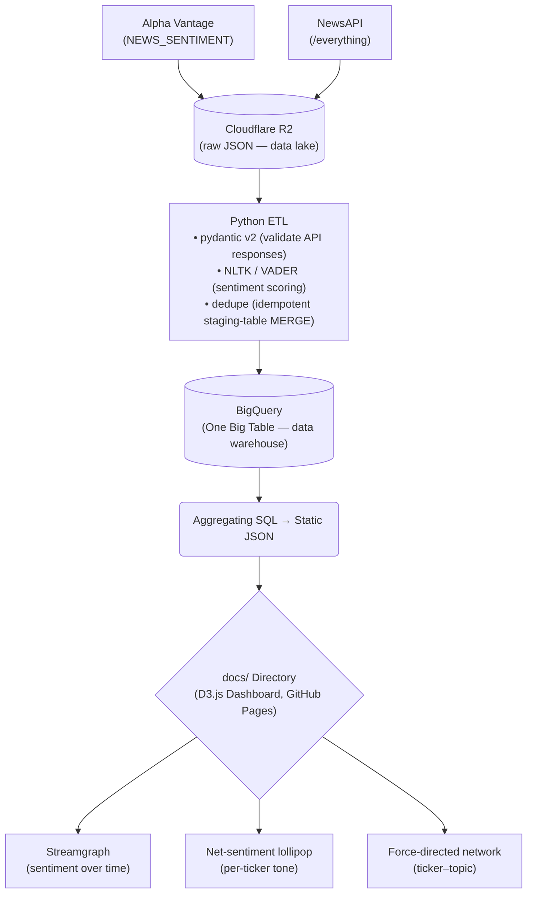
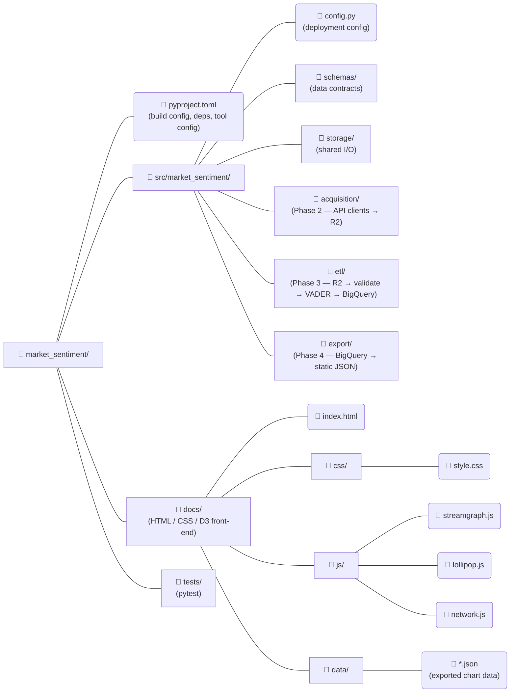

# Market Sentiment and Real-Time Finanical Intelligence
*An end-to-end pipeline that turns financial news, received as raw API payloads, into an interactive D3.js dashboard that gives a glance at how the market is perceiving tech stocks.*

[Live dashboard](https://jdpretorius123.github.io/market_sentiment/docs/)

# Overview
Financial-news articles are a great source of data! Volume and tone of coverage can be used to determine how the market is talking about a company at a given moment. This project ingests financial-news for tech stocks, scores the tone of every article, and compiles the results into interactive visualizations that answer:
- How does coverage volume and tone fluctuate over time?
- How does sentiment change from one company to the next?
- Which topics is each company associated with?

The complete data science lifecyle is on full display using a monthly batch cadence:
- Acquisition
- Engineering
- Analysis
- Visualization

# Live Dashboard
The dashboard is a static site on GitHub Pages that loads three JSON files and renders them with D3.

## The Visualizations
| Chart | What it Shows | How to Read It |
| :---- | :---- | :---- |
| Streamgraph | Article volume over time, stacked by sentiment band | Band thickness denotes the number of articles per day, and the color reflects the tone: positive, neutral, and negative |
| Lollipop Charts | Each stock's net-sentiment coverage | Each lollipop shows a company's net sentiment, which is the share of positive coverage minus negative coverage. Companies are ranked from most net-positive at the top.  |
| Force-directed Network Graph | Ticker-to-topic co-occurrence | Edges link a company to topics is discussed with, node size reflects article volume, and color is equal to average sentiment |

# Analytical Caveats
- The network shows raw co-occurrence counts, not lift. Therefore a large, central topic reflects high exposure, not a distinctive association.
- Sentiment is scored with VADER, which measures valence (the intensity and polarity of an emotion) and not emotion.

# Architecture

Data is one directional. Each stage (acquisition -> ETL -> export) sits on shared leaf layers (storage I/O, data-contract schemes, config), so every phase is independently testable and the dependencies never cycle.

# Tech Stack

## Languages
- Python 3.12 — acquisition, ETL, and export pipeline
- JavaScript (ES2022 modules) — dashboard interactivity
- HTML5 / CSS3 — dashboard structure and styling
- SQL — BigQuery aggregation queries

## Data lake & warehouse
- Cloudflare R2 — raw JSON object storage (data lake)
- Google BigQuery — structured, sentiment-scored warehouse (single OBT, nested fields)

## Data sources
- Alpha Vantage — NEWS_SENTIMENT endpoint
- NewsAPI — /everything endpoint

## Core Python libraries
- pydantic v2 — API-response validation / data contracts
- NLTK + VADER — sentiment scoring
- boto3 — R2 access via the S3-compatible API
- google-cloud-bigquery — warehouse loads (staging + MERGE) and reads
- python-dotenv — environment / secret loading

## Visualization
- D3.js v7 — streamgraph, net-sentiment lollipop, force-directed network
- Font Awesome — icons

## Tooling
- pyproject.toml + Hatchling — installable src/ package
- Ruff — linting + formatting (PEP 8)
- pytest — test framework
- pyenv-win — Python version pinning (3.12.0)
- Git / GitHub — version control; GitHub Pages — dashboard hosting

# Pipeline by phase
1. Acquisition (src/market_sentiment/acquisition/) — REST clients for Alpha Vantage NEWS_SENTIMENT and NewsAPI /everything fetch one month of articles per ticker and land the raw JSON responses, unmodified, in Cloudflare R2. Keeping a copy in the data lake means the warehouse can always be rebuilt from source.

2. ETL (src/market_sentiment/etl/) — reads the raw JSON from R2, validates every payload against pydantic contracts, scores each article's tone with VADER, normalizes both providers into one unified row shape, deduplicates, and loads the result into BigQuery via a staging table and MERGE.

3. Export (src/market_sentiment/export/) — runs three aggregating SQL queries against the warehouse and writes small static JSON files (docs/data/*.json). There is one file per chart. Aggregating in SQL keeps the browser payloads tiny.

4. Dashboard (docs/) — three D3 v7 modules load their JSON and render the charts. Pure static front-end that is deployable to GitHub Pages as-is.

# Data model
The warehouse is modeled as a single denormalized "One Big Table" (OBT), article_sentiment: one row per article-ticker mention, with nested topics and authors. This lets the analytical queries run without joins, and is a natural fit for read-heavy, append-only analytical data.

| Column | Type | Mode | Note |
| :---- | :---- | :---- | :---- |
| row_id | STRING | REQUIRED | SHA-256 of the natural key; the MERGE join key |
| provider | STRING | REQUIRED | alpha_vantage or newsapi |
| ticker | STRING | REQUIRED ||
| fetch_date | STRING | REQUIRED | YYYY_MM_DD batch date |
| published_at | TIMESTAMP | REQUIRED | article publication time (UTC) |
| title / text / url | STRING | REQUIRED ||
| source_name | STRING | NULLABLE | NewsAPI source; null on some rows |
| authors | STRING |||
| ticker_sentiment_score / _label | FLOAT64 / STRING | NULLABLE | Alpha Vantage only |
| topics | RECORD <topic, relevance_score> | REPEATED | Alpha Vantage only |
| vader_compound / _pos / _neu / _neg | FLOAT64 | REQUIRED | VADER scores |

<h3>Idempotency</h3>
Loads are not naive inserts. Each batch lands in a uniquely named staging table, then a MERGE on row_id inserts only rows the target doesn't already have, so re-running the same month never
duplicates data. BigQuery does not enforce primary keys, so this is enforced explicitly in the
loader.

# Project Structure


# Setup
## Prerequisites
- Python 3.12.0 (via pyenv)
- Cloudflare R2 bucket 
- Google Cloud project with BigQuery enabled

### Python and virtual environment

```python
pyenv install 3.12.0
python -m venv .venv
.venv\Scripts\Activate.ps1     # PowerShell (Windows)
```

### Install the package and dev dependencies

```python
pip install -e ".[dev]"
```

### One-time: download the VADER lexicon

```python
python -c "import nltk; nltk.download('vader_lexicon')"
```

# Credentials
- Cloudflare R2
  - Copy .env.example to .env and fill in your R2 access keys
  - Loaded at runtime by python-dotenv
  - .env is git-ignored

- Google Cloud
  - Uses Application Default Credentials (no JSON key file)

```bash
gcloud auth application-default login
gcloud config set project <your-project-id>
gcloud auth application-default set-quota-project <your-project-id>
```

# Running the pipeline
The pipeline runs as a monthly batch, one stage at a time:
```python
python -m market_sentiment.acquisition.main   # fetch -> R2
python -m market_sentiment.etl.main           # R2 -> validate -> score -> BigQuery
python -m market_sentiment.export.main        # BigQuery -> docs/data/*.json
```

Then open `docs/index.html` locally, or visit the deployed GitHub Pages URL.

# Design decisions & trade-offs
- One Big Table over a star schema
    - Read-heavy, append-only analytical data with no transactional
    updates
    - Nested topics/authors keep everything in one row and the queries
    join-free
- Static JSON export over a backend
    - The monthly cadence means a snapshot is never meaningfully
    stale, so there's no reason to pay for a live API
    - Benefits: free hosting, no DB credentials in the browser, and a trivially cacheable dashboard
- Monthly batch over streaming
    - The analytical question ("how is sentiment trending") doesn't need
    sub-day freshness, and batches are simpler, cheaper, and easier to reason about
- Staging table and MERGE for idempotency
    - BigQuery doesn't enforce primary keys, so re-runnability is
    enforced in code, and re-processing the same R2 data is no-op
- ADC over service-account JSON keys
    - New GCP orgs block JSON key creation by default, and JSON keys
    are the most-leaked cloud credential
    - ADC is Google's recommended local-dev pattern
- Single-direction dependency flow
    - Stages depend on shared leaf layers, never on each other, so each
    phase is independently testable.

# Roadmap
- Sentiment-vs-price correlation
    - Join tone against price movements to close the loop on the original motivating question.
- Lift-weighted network edges
    - Weight ticker–topic edges by lift, not raw count, to surface distinctive associations.
- Parquet in the lake
    - Switch R2 storage from JSON to parquet once volume justifies it.

# Code quality
- PEP 8 enforced via Ruff (lint and format)
- Google-style docstrings
- Installable src/ package 
    — `pip install -e ".[dev]"` pulls runtime and dev deps from a single pyproject.toml
- Tests are collected from tests/

# Contact
- [GitHub](https://github.com/jdpretorius123)
- [X](https://x.com/jdpretorius_)
- [LinkedIn](https://www.linkedin.com/in/justin-p-996555172/)
- [Email](mailto:justin2025@gmail.com)